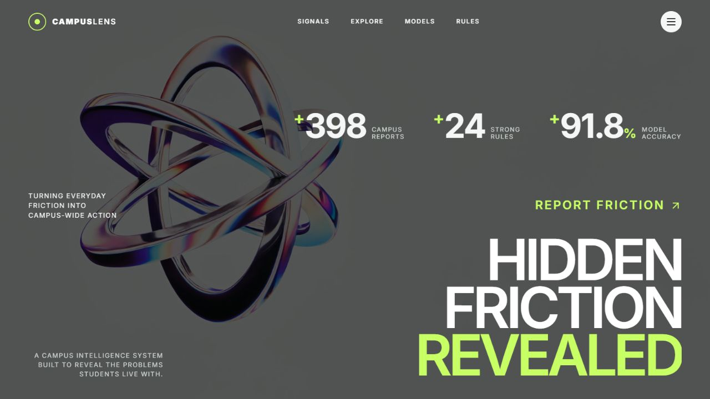
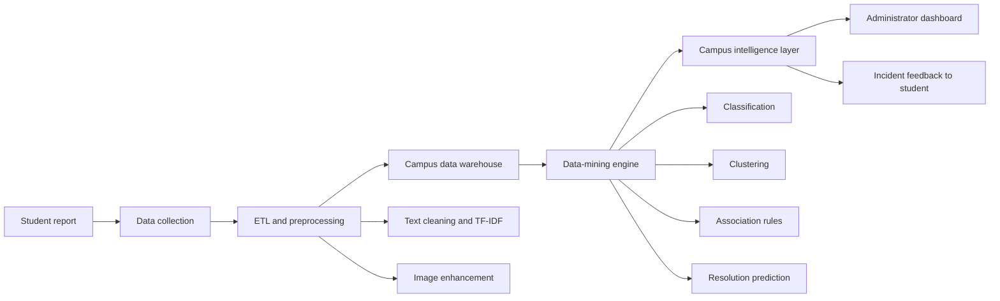
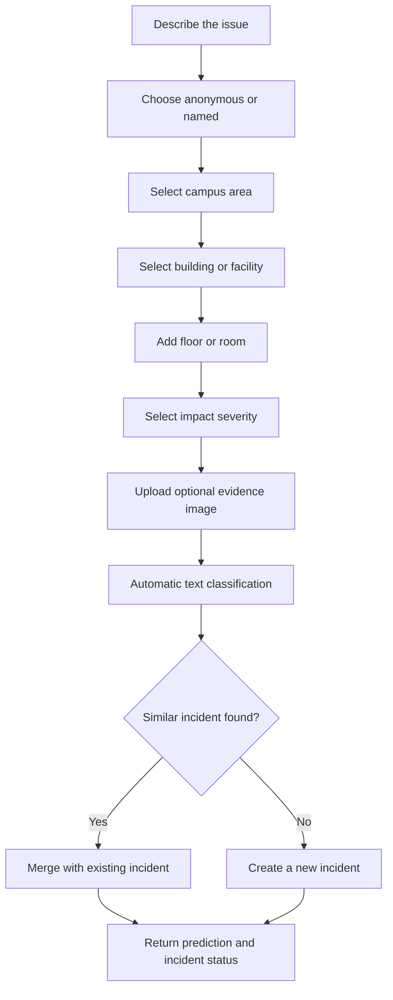
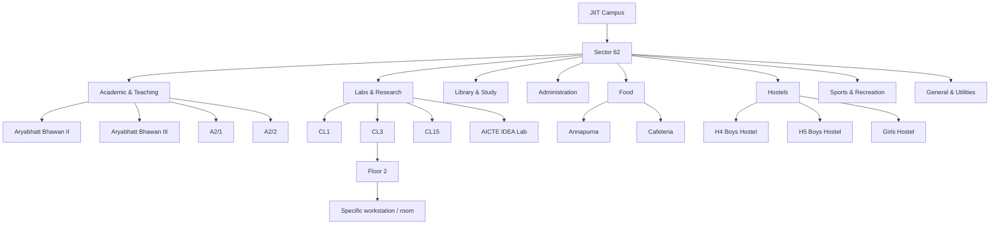
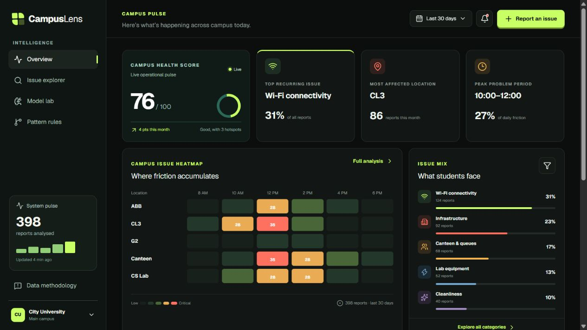
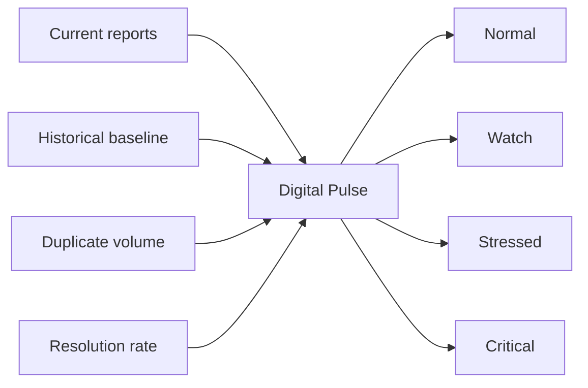
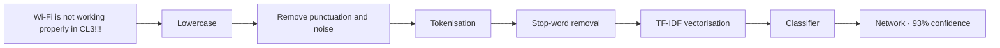
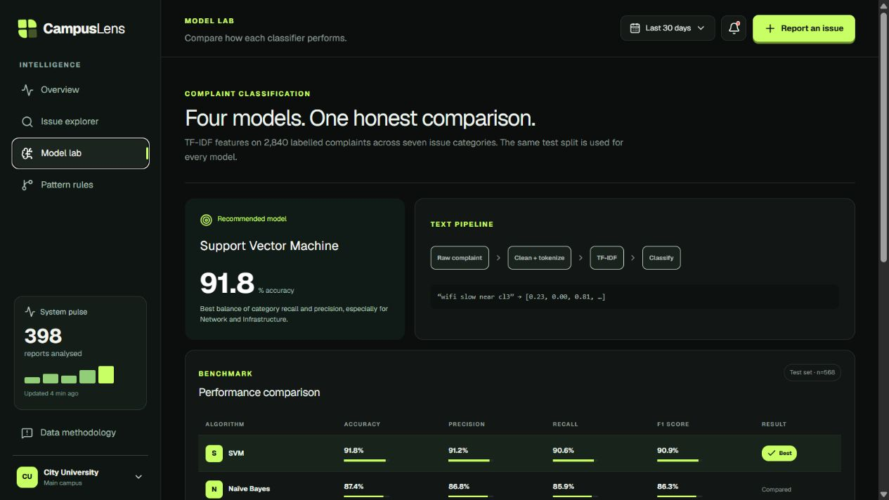
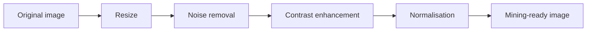
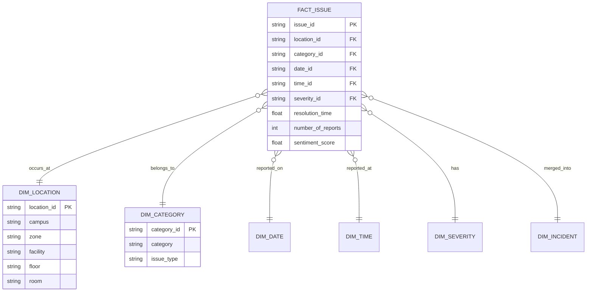

# CampusLens

### Mining the hidden problems of a college campus

CampusLens is a **Campus Friction Intelligence System** that transforms everyday student complaints into operational insight. Instead of treating each report as an isolated ticket, the platform mines complaint text, location hierarchies, timestamps, severity, images, duplicate patterns and historical trends to answer four questions:

> **What problems repeatedly affect students? Where and when do they occur? Which conditions appear together? What should the campus address first?**

The project combines a student-friendly reporting experience with an administrator-facing intelligence dashboard. It demonstrates text mining, image preprocessing, classification, clustering, association-rule mining, regression, multidimensional analysis, OLAP drill-down and data-warehouse design in one cohesive system.



---

## The problem

Students experience recurring operational friction across campus:

- unstable Wi-Fi and network outages;
- broken projectors, furniture, fans and air conditioning;
- laboratory computers and equipment failures;
- overcrowded classrooms and canteen queues;
- cleanliness and washroom issues;
- unavailable drinking water;
- parking congestion and blocked walkways.

These problems are usually reported through disconnected conversations, forms or emails. That makes it difficult to distinguish a one-off complaint from a campus-wide pattern. CampusLens creates a single analytical pipeline that consolidates reports and exposes recurring incidents, hotspots, peak periods and emerging anomalies.

## Project objectives

1. Collect structured and unstructured campus issue data.
2. Automatically classify complaint text into meaningful categories.
3. Detect similar reports and merge them into shared incidents.
4. Analyse issues across location, time, category and severity dimensions.
5. Discover hidden associations using support, confidence and lift.
6. Compare Naïve Bayes, kNN, ID3 and SVM classifiers.
7. Predict issue severity and expected resolution time.
8. Demonstrate image preprocessing using submitted evidence.
9. Present insights through a decision-support dashboard.

---

## Platform overview



CampusLens is divided into six connected modules:

| Module | Responsibility |
|---|---|
| Data Collection | Complaint form, evidence upload, location, time and identity preference |
| ETL & Preprocessing | Text normalization, tokenisation, TF-IDF and image enhancement |
| Data Warehouse | FactIssue records and analytical dimensions |
| Data Mining | Classification, duplicate detection, clustering, rule mining and prediction |
| Evaluation | Accuracy, precision, recall, F1, confusion matrix, RMSE and WEKA comparison |
| Intelligence Dashboard | Heatmaps, digital pulse, health score, trends and recommendations |

---

## Student issue reporting

The reporting flow intentionally remains simple while collecting enough metadata for mining.



Each report can contain:

- issue title and detailed description;
- automatic and user-correctable category;
- campus area, facility, floor and room;
- impact rating;
- anonymous or named submission preference;
- automatically captured timestamp;
- optional image evidence.

After submission, CampusLens returns the predicted category, confidence, risk level, estimated resolution time and any duplicate incident match.

---

## Hierarchical JIIT Sector 62 location model

A flat location dropdown cannot support room-level heatmaps or OLAP analysis. CampusLens therefore models locations as a hierarchy.



The implemented master list also includes LRC areas, administrative offices, seminar halls, sports facilities, gyms, parking, water coolers, washrooms, lifts, corridors and network-infrastructure points. Optional room codes such as `CR425`, `FF6`, `G2`, `CL22` and `TS17` can be captured without pretending that a publicly unavailable room inventory is complete.

---

## Intelligence dashboard

The dashboard is designed as a decision-support system rather than a list of complaints.



### Campus health score

The health score summarises open issue volume, severity, recurrence and resolution performance into a value from 0 to 100. It can be calculated for the whole campus, a category or an individual location.

### Campus problem heatmap

The heatmap shows issue intensity by location and time block. Administrators can move from campus-level patterns to a building, floor, room, category and specific issue.

### Emerging issue detector

Current complaint frequency is compared with historical frequency. A sudden increase—for example, projector failures rising far above their normal weekly baseline—is surfaced before it becomes a long-running problem.

### CampusLens Digital Pulse

Every location receives a continuously calculated state between **Normal** and **Critical**. The state combines repeat complaints, issue severity, duplicate volume, unresolved time and resolution rate.



---

## Text-mining pipeline

Complaint descriptions are converted from free text into features that classification algorithms can process.



The interactive prototype includes a lightweight keyword classifier so the complete reporting flow works with synthetic data. The project architecture supports replacing it with a trained model API without changing the reporting interface.

## Classification and model evaluation

The same labelled complaint dataset is evaluated with four syllabus algorithms:

- Naïve Bayes;
- k-Nearest Neighbours;
- ID3 decision tree;
- Support Vector Machine.



| Model | Accuracy | Precision | Recall | F1 score |
|---|---:|---:|---:|---:|
| SVM | 91.8% | 91.2% | 90.6% | 90.9% |
| Naïve Bayes | 87.4% | 86.8% | 85.9% | 86.3% |
| kNN | 84.6% | 83.5% | 84.1% | 83.8% |
| ID3 | 81.9% | 80.7% | 81.4% | 81.0% |

These values represent the demonstration experiment included in the interface and should be replaced with the final experiment output when the complete labelled dataset is frozen.

The platform also includes:

- confusion-matrix visualisation;
- downloadable WEKA-compatible ARFF data;
- side-by-side Python and WEKA validation support;
- best-model recommendation based on validation F1.

---

## Duplicate complaint detection

CampusLens consolidates semantically similar reports from the same location into a shared incident.

```text
"Wi-Fi is not working in CL3"
"Internet is slow in CL3"
"CL3 network is down"
                    ↓
Incident INC-NET-74
3 related reports · HIGH priority
```

The interactive demonstration evaluates category, location and existing incident frequency. A production mining service can extend this with sentence embeddings and cosine similarity.

---

## Image preprocessing

Uploaded evidence is prepared for analysis using the image-processing pipeline required by the project syllabus.



The Model Lab displays before-and-after evidence preparation. The image component focuses on preprocessing and quality enhancement; it does not require a large CNN to demonstrate the relevant mining workflow.

---

## Data warehouse and OLAP

CampusLens separates analytical dimensions from measurable complaint facts.



Supported drill paths include:

```text
Campus → Zone → Facility → Floor → Room → Category → Specific issue
Year → Semester → Month → Week → Day → Hour
```

This enables questions such as:

> Show Network complaints → Labs & Research → CL3 → Floor 2 → August → 10 AM–12 PM.

---

## Association-rule mining

Apriori-style rules expose combinations of conditions that repeatedly occur with a problem.

```text
{ CL3, Monday, 10 AM–12 PM } ⇒ { Network issue }
Support: 18.4% · Confidence: 82% · Lift: 2.7×

{ Main canteen, Wednesday, 1 PM–2 PM } ⇒ { Queue high }
Support: 15.1% · Confidence: 88% · Lift: 3.1×
```

The Pattern Rules workspace provides an interactive minimum-lift filter and displays support, confidence and lift for every discovered association. The same transaction export can be evaluated in R.

---

## Clustering and prediction

Unsupervised clustering groups complaints that share hidden characteristics. The synthetic experiment surfaces four interpretable clusters:

1. Morning network failures;
2. Classroom equipment issues;
3. Peak-hour canteen congestion;
4. Seasonal water and leakage problems.

CampusLens additionally demonstrates two predictive tasks:

| Task | Type | Example output | Evaluation |
|---|---|---|---|
| Issue risk | Classification | `CRITICAL` | Accuracy, precision, recall, F1 |
| Resolution time | Regression | `2.7 hours` | RMSE |

Predicted risk considers complaint text, location, selected impact, duplicate volume and historical recurrence. Resolution time considers category, severity, location, report count and historical repair duration.

---

## Synthetic dataset

The interactive platform is seeded with synthetic complaint records so every dashboard feature can be demonstrated without exposing real student data.

Each record contains:

```text
issue_id, title, complaint, category, campus_area,
facility, floor_or_room, timestamp, impact, status,
image, predicted_category, confidence, duplicate_count,
incident_id, predicted_risk, expected_resolution_hours
```

Example record:

```json
{
  "issue_id": "CL-1048",
  "category": "Network",
  "location": "CL3 · Floor 2",
  "impact": 2,
  "status": "Recurring",
  "complaint": "Wi-Fi drops every few minutes during the morning lecture block."
}
```

Reports added through the interface immediately update the live feed, report count and Issue Explorer for the current session. Search, hierarchical filters, CSV export and WEKA ARFF export all operate on the shared synthetic-data layer.

---

## Functional coverage

| Capability | CampusLens implementation |
|---|---|
| Student issue reporting | Two-step anonymous/named form with hierarchical location and image upload |
| Automatic classification | Category and confidence returned after submission |
| Duplicate detection | Similar location/category reports merge into an incident |
| Heatmap | Location × time intensity matrix |
| Time mining | Hour and week trend visualisations |
| OLAP drill-down | Campus to room and time hierarchy |
| Data warehouse | Visible FactIssue star-schema design |
| Association rules | Support, confidence, lift and minimum-lift filtering |
| Emerging issues | Current-versus-historical anomaly card |
| Campus health | Overall and location-oriented health indicators |
| Severity prediction | Low, medium, high or critical risk |
| Resolution prediction | Expected hours and RMSE |
| Image preprocessing | Original versus enhanced evidence pipeline |
| Clustering | Four interpretable issue groups |
| Model comparison | NB, kNN, ID3 and SVM metrics |
| WEKA experiment | Downloadable ARFF dataset |
| Digital Pulse | Normal-to-critical location state |

---

## Technology stack

- **Next.js 16** and React 19;
- TypeScript;
- Tailwind CSS processing and custom responsive CSS;
- Framer Motion for interface transitions;
- Lucide React for accessible interface icons;
- Mermaid diagrams for project documentation;
- Vercel for the current web demonstration.

## Current scope

CampusLens currently provides a complete interactive **synthetic-data demonstration** of the mining and intelligence workflow. User-added records remain available for the active browser session. A durable production implementation would connect the same typed complaint model to a relational database, object storage and trained Python/R mining services.

The central project idea remains the same:

> **CampusLens is not merely a complaint-management portal. It is a digital campus pulse that mines operational data to discover recurring problems, emerging anomalies and hidden relationships.**
