# CampusLens

### Mining the hidden problems of a college campus

CampusLens is a campus-friction intelligence system for discovering which problems students repeatedly face, where and when they occur, and which operating conditions tend to appear together. It combines anonymous issue reporting with a reproducible data warehouse, text and image mining, supervised and unsupervised learning, spatial analysis, stream monitoring, and decision-support dashboards.

This repository is an academic data-mining project, not a claim about actual JIIT campus conditions. The benchmark records, labels, images, web sessions, and anomaly ground truth are synthetic. That boundary is deliberate and visible throughout the interface and artifacts.

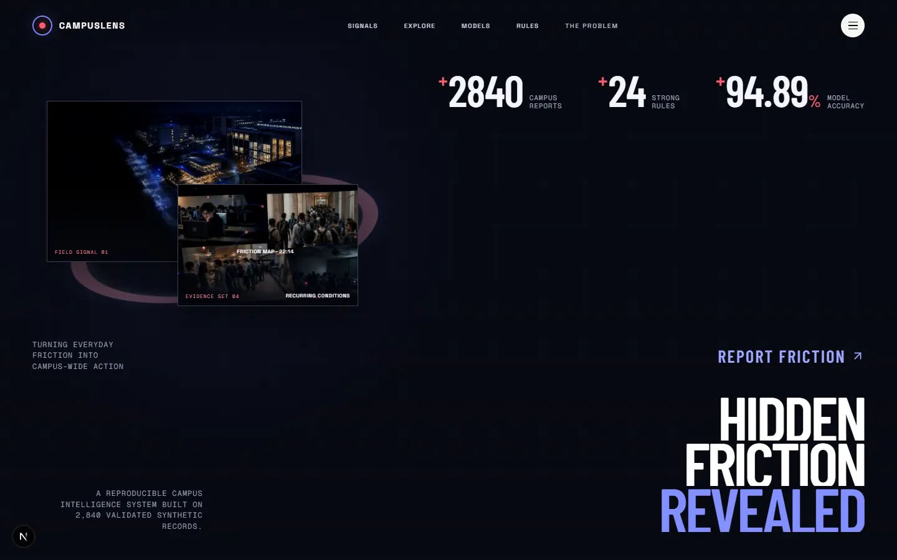

## The problem

Campus problems are normally scattered across conversations, forms, emails, and informal groups. A single Wi-Fi report says little; hundreds of time-, place-, and context-linked observations can reveal a recurring service pattern.

CampusLens reframes complaint collection as a knowledge-discovery problem:

> How can heterogeneous, anonymous campus reports be transformed into reliable multidimensional intelligence that reveals recurring friction, spatial and temporal hotspots, associated conditions, emerging anomalies, and likely operational risk?

Reports can describe network failures, damaged infrastructure, cleanliness, food-service queues, electrical problems, lab equipment, water availability, parking, or another operational issue. Each report may contain text, a hierarchy-valid location, time, impact rating, environmental context, and optional visual evidence.

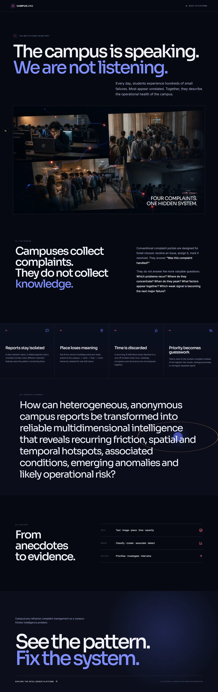

## System at a glance

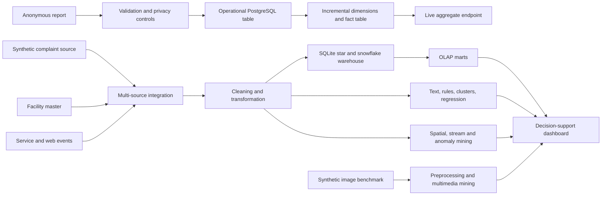

The deployed application is a dark, responsive Next.js interface. The landing page introduces the problem visually; the workspace provides a campus pulse, issue explorer, model laboratory, validated rules, advanced-mining evidence, methodology, and a report form.

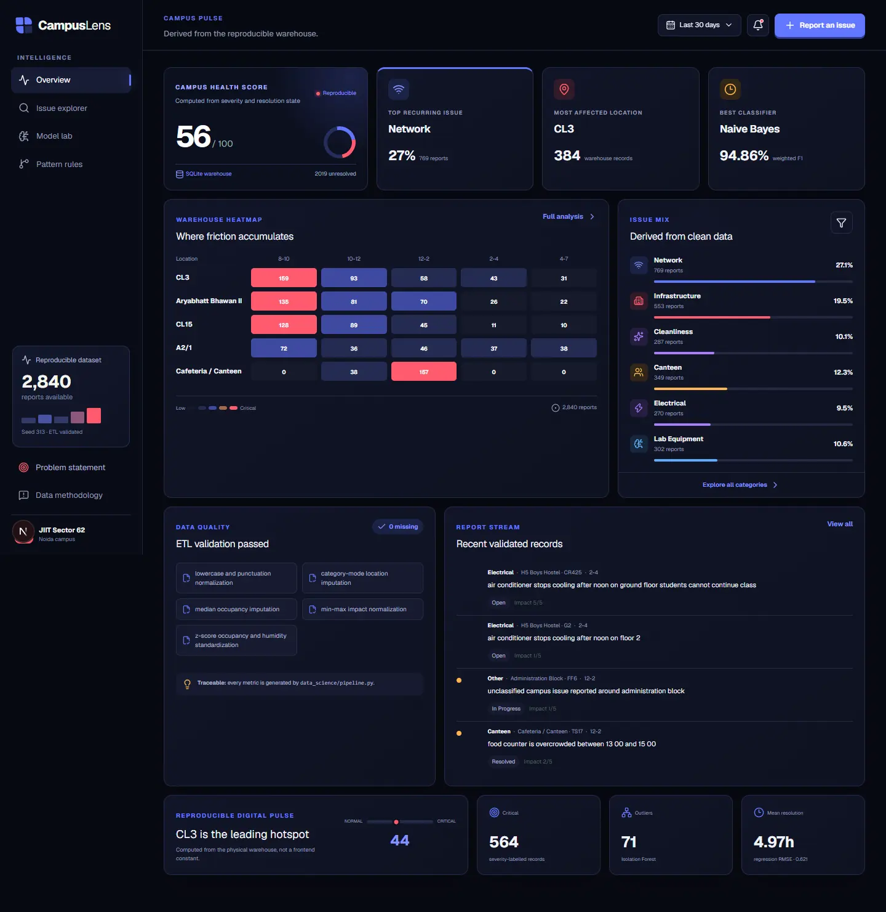

## Data design

### Integrated sources

The reproducible benchmark contains 2,840 complaint facts built from three independently represented sources:

| Source | Role |
|---|---|
| Student complaint stream | Text, category, impact, time, status, contextual measurements |
| Facility master | Valid campus → zone → facility → floor → room ownership and generalized coordinates |
| Campus service/web events | Session counts, dwell, route transitions, searches, and service context |

The generator first selects a valid location from the master hierarchy, derives the weekday from the actual timestamp, and then samples overlapping probabilistic issue conditions. It does not create random facility-room Cartesian pairs.

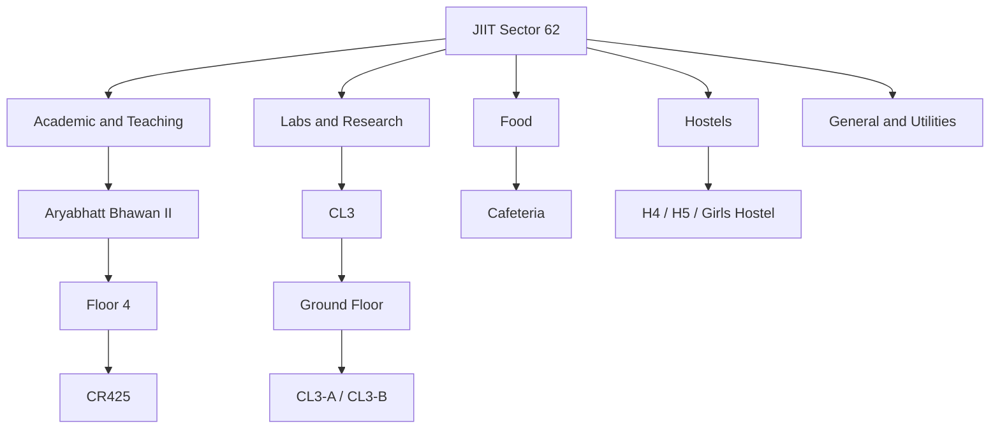

Current semantic checks:

| Check | Result |
|---|---:|
| Unique cleaned complaint text | 100% |
| Test text duplicated in development data | 0% |
| Test template groups seen in development | 0 |
| Timestamp/weekday consistency | 100% |
| Valid location hierarchy | 100% |
| Missing values after preprocessing | 0 |

### Preprocessing and transformation

The pipeline demonstrates cleaning, integration, imputation, normalization, discretization, reduction, hierarchy validation, and sampling. Defects are inserted independently of the target label and repaired using target-independent logic.

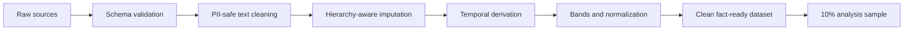

An ETL/ELT comparison is recorded in the data-quality artifact, including row counts, timing, transformation placement, and trade-offs. The metadata catalogue records business meaning, type, nullability, allowed domains, sensitivity, steward, refresh frequency, lineage, quality thresholds, and relationships.

## Warehouse and OLAP

CampusLens materializes both a star schema and a normalized snowflake schema in `warehouse/campuslens.db`.

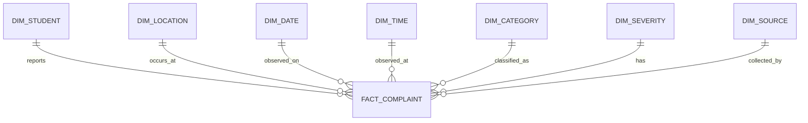

The normalized location path is physical, not illustrative:

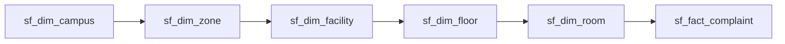

Warehouse evidence:

- 2,840 star facts and 2,840 snowflake facts
- Executable roll-up view implemented with SQLite-compatible `UNION ALL`
- Roll-up, drill-down, slice, dice, and pivot queries
- Six expired SCD Type-2 location versions with `valid_from`, `valid_to`, and `is_current`
- Foreign-key validation with zero violations
- ETL audit, data marts, indexes, surrogate keys, and lineage metadata

New community submissions also enter a PostgreSQL location dimension and complaint fact table immediately, create an ETL audit record, and update the live aggregate endpoint. This closes the earlier split between a “live” report list and static intelligence.

## Text classification

The category task compares seven algorithms:

- Multinomial Naïve Bayes
- k-nearest neighbours
- ID3 decision tree
- linear SVM
- Random Forest
- neural network/backpropagation
- Extra Trees ensemble

Model selection uses template fold 3. Final evaluation happens once on untouched template fold 4. Four-fold `StratifiedGroupKFold` cross-validation groups complaints by authored template. The pipeline also provides a most-frequent baseline, macro and weighted metrics, per-class metrics, a 95% bootstrap interval, McNemar comparison, subgroup performance, and calibrated browser probabilities.

| Selected model | Holdout accuracy | Holdout macro-F1 | Grouped-CV macro-F1 | 95% macro-F1 CI | Baseline macro-F1 |
|---|---:|---:|---:|---:|---:|
| Neural Network | 56.66% | 57.68% | 45.16% | 53.06–61.54% | 3.71% |

The moderate result is intentional evidence of a harder unseen-language task. It replaces the previous leaked ~95% headline.

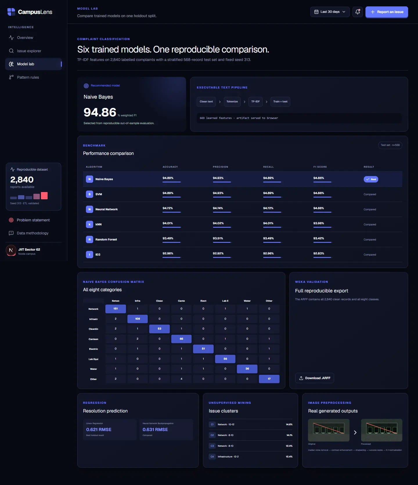

### Independent WEKA experiment

Weka 3.8.7 trains a `FilteredClassifier(StringToWordVector → NaiveBayes)` on 2,307 development records and evaluates 533 unseen-template records. The checked-in evidence includes:

- development and test ARFF files
- complete evaluation summary and confusion matrix
- per-class metrics
- experiment configuration
- a 1.6 MB serialized Weka model

Weka obtains 53.66% accuracy and 0.531 weighted F1 on the same difficult boundary. This is genuine command-line Weka output, not a screenshot-only claim.

## Association rules and correlation

Transactions contain facility type, time band, day, occupancy, humidity, severity, source channel, and category. Apriori and FP-Growth must agree on the frequent itemsets.

Rules are mined on the first 70% of time and validated on the last 30%. Accepted rules must have:

- one category consequent
- one or two non-category antecedents
- at least one contextual antecedent
- minimum training and validation support
- stable confidence across periods
- validation lift above one
- Fisher exact-test significance after Benjamini–Hochberg FDR correction
- redundant supersets pruned

Four rules currently survive. A separate base-R implementation produces the same four rules, giving a Python/R Jaccard agreement of 1.0. Cramér’s V results provide a distinct correlation-analysis artifact.

Low support is treated as exploratory; lift alone is never presented as proof.

## Regression

Resolution-time regression uses a chronological 70/15/15 split and selects a model on the validation period before one future holdout evaluation.

| Model | RMSE | MAE | R² |
|---|---:|---:|---:|
| Mean baseline | 2.209 | 1.514 | -0.003 |
| Linear Regression | 2.206 | 1.504 | -0.000 |
| Random Forest Regressor | **2.116** | **1.508** | **0.079** |
| Neural Network | 2.151 | 1.547 | 0.049 |

The weak R² is shown plainly. The artifact also contains residual quantiles, a 90% prediction interval, validation RMSE, and feature importance. Target generation includes unobserved maintenance and vendor factors so the model cannot simply reverse a deterministic formula.

## Clustering and anomaly detection

Five unsupervised methods are compared on a tuning/evaluation split:

| Method | Selected structure | Silhouette | Interpretation |
|---|---:|---:|---|
| K-Means | 6 clusters | 0.1401 | weak separation; stability ARI 0.9218 |
| Hierarchical | 6 clusters | 0.0887 | very weak separation |
| Gaussian Mixture | 10 components by BIC | -0.0320 | poor geometric separation |
| DBSCAN | 5 clusters, 433 noise | -0.2076 | poor density structure |
| STING-style grid | 18 cells | -0.0908 | grid coverage, not natural clusters |

K is selected across 2–12 rather than fixed to the known class count. Names come from top terms, not ground-truth categories. The UI labels these clusters exploratory.

Isolation Forest uses a labelled synthetic anomaly validation set to select its threshold and a chronological holdout to report precision, recall, and F1. The current anomaly F1 is 0.414; that limitation is more scientifically meaningful than forcing a fixed contamination count and calling every flagged point correct.

## Image and multimodal mining

Image handling has two distinct layers.

1. Upload privacy: the server decodes, validates, rotates, resizes, flattens, and re-encodes images as WebP. Metadata is removed. The database stores only a SHA-256 fingerprint and MIME type; the thumbnail returned to the submitting browser is ephemeral.
2. Mining experiment: a synthetic labelled image set is transformed into texture, edge, colour, brightness, and histogram features. A Random Forest visual classifier, PCA embedding, confusion matrix, per-class metrics, and cosine duplicate search are generated.

The visual holdout reaches 83.33% accuracy and 83.22% macro-F1.

| Original evidence | Enhanced evidence |
|---|---|
| 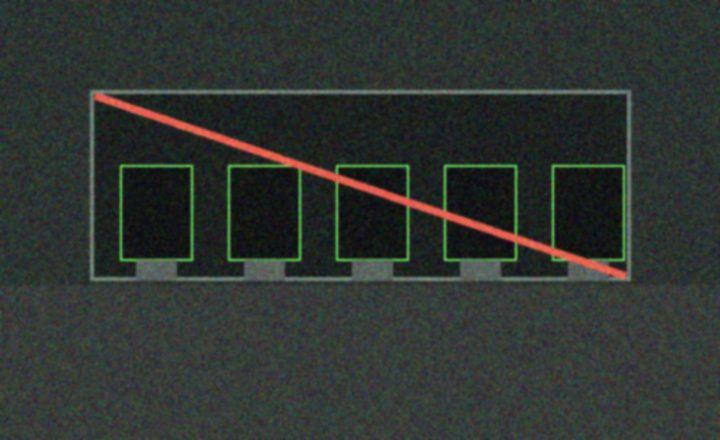 | 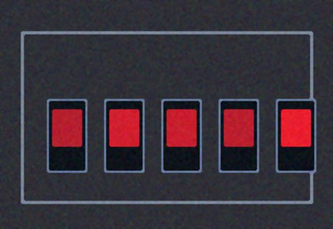 |

## Advanced mining

### Spatial mining

Twenty-two valid facility centroids are analyzed with global and local Moran-style statistics and an 8×8 grid. Global Moran’s I is 0.0182, correctly indicating little global spatial autocorrelation. Coordinates are generalized; no person-level location is stored.

### Web mining

The service-event source contains 5,680 privacy-safe synthetic events. The experiment extracts route popularity, search intent, report-conversion rates, dwell time, and first-order route transitions.

### Stream mining

A bounded sliding window tracks category distributions and impact. Jensen–Shannon divergence flags drift; drift queues human review and retraining rather than silently replacing a deployed model.

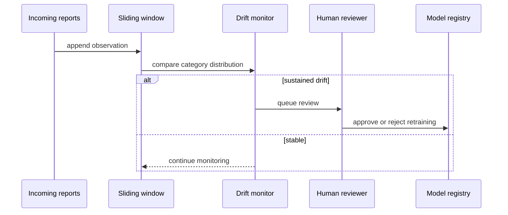

## Live reporting, privacy, and governance

CampusLens accepts anonymous reports without requiring an identity. Administrative reads require a bearer token. Public records never expose names, hashes, image payloads, or administrative-only fields.

Controls include:

- PII redaction in both title and description
- one-way reporter alias hashing when a non-anonymous alias is supplied
- persistent PostgreSQL rate limiting using hashed client identifiers
- same-origin and JSON content-type checks
- strict size/type validation and server-side image re-encoding
- no base64 image storage
- protected admin scope
- 365-day retention with authenticated daily cleanup
- audit logs, incremental ETL logs, and a refresh queue
- model registry with dataset SHA-256, stage, protocol, monitoring, and human approval
- ethics report covering domain shift, under-reporting, privacy, and automation bias
- channel and facility-type subgroup performance; no unsupported demographic-fairness claim

## Business-intelligence artifacts

The project includes two source-controlled external BI artifacts:

- `data_science/powerbi/CampusLens.pbip`: a Power BI Project using the documented PBIP/PBIR structure and a TMDL semantic model with import partition and DAX measures.
- `data_science/tableau/CampusLens.twb`: a Tableau workbook with issue-mix and facility-hotspot sheets in a campus-health dashboard.

PBIP is used instead of an opaque PBIX so the semantic model, data source, measures, report page, and lineage remain reviewable in Git.

## Course-outcome coverage

| Outcome | Demonstrated evidence |
|---|---|
| CO1 — warehousing, OLAP, mining concepts | Physical star and snowflake schemas; facts/dimensions; marts; SCD2; executable OLAP; PBIP and Tableau artifacts |
| CO2 — preprocessing and transformation | Three-source integration; cleaning; hierarchy-aware imputation; normalization; discretization; sampling; ETL/ELT comparison; metadata/lineage |
| CO3 — association and classification | Apriori, FP-Growth, base-R rules, FDR/holdout validation, Cramér’s V, seven classifiers, grouped CV, WEKA |
| CO4 — clustering and discovery | K-Means, hierarchical, DBSCAN, Gaussian mixture, STING grid, tuning, stability, labelled anomaly evaluation |
| CO5 — advanced real-world mining | Spatial autocorrelation, web usage mining, windowed stream drift, image classification/embedding/duplicate search, governance |

## Reproducibility and evidence map

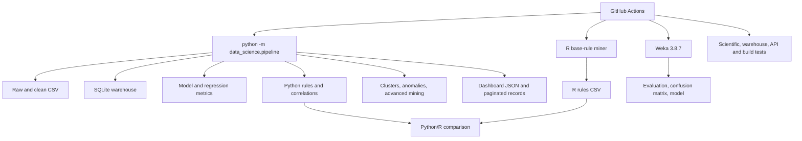

The principal evidence lives in:

- `data_science/outputs/` — metrics, rules, model registry, fairness, advanced-mining, R, and Weka outputs
- `warehouse/` — database, DDL, OLAP SQL, and metadata catalogue
- `public/data/` — browser-safe analytics, classifier, ARFF, and paginated records
- `data_science/powerbi/` and `data_science/tableau/` — external BI projects
- `data_science/test_pipeline.py` — semantic and scientific invariants
- `scripts/test-api.mjs` — running API privacy/security contract

## Honest limitations

- Synthetic evidence can validate software and experimental design, not establish actual campus prevalence.
- Classification performance on unseen authoring templates is moderate and subject to real-language domain shift.
- Cluster separation is weak; clusters are exploratory summaries rather than proven operational segments.
- Regression explains little holdout variance because important maintenance/vendor factors remain unobserved.
- Spatial coordinates are generalized centroids, so room-scale geographic conclusions are inappropriate.
- Demographic fairness cannot be claimed because protected attributes are deliberately excluded.
- Visual mining uses a controlled synthetic image benchmark and needs independently labelled real evidence before operational use.

CampusLens is therefore best understood as a transparent end-to-end mining laboratory and decision-support prototype: it demonstrates how campus friction could be collected, governed, warehoused, evaluated, and explored without disguising synthetic results as institutional truth.
