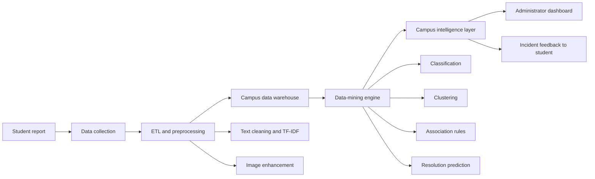
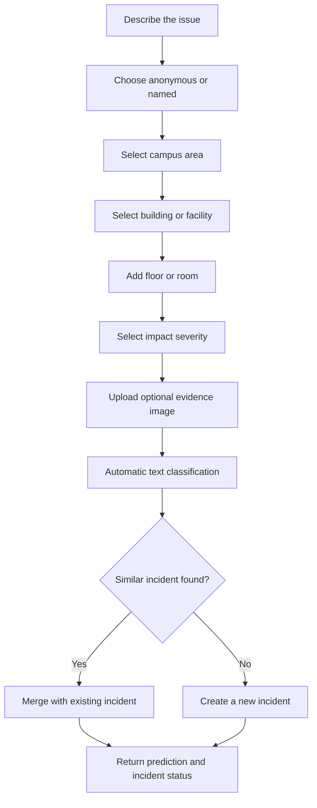
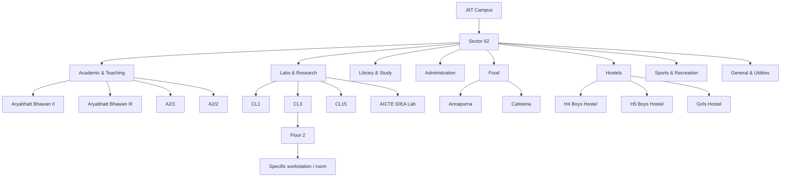
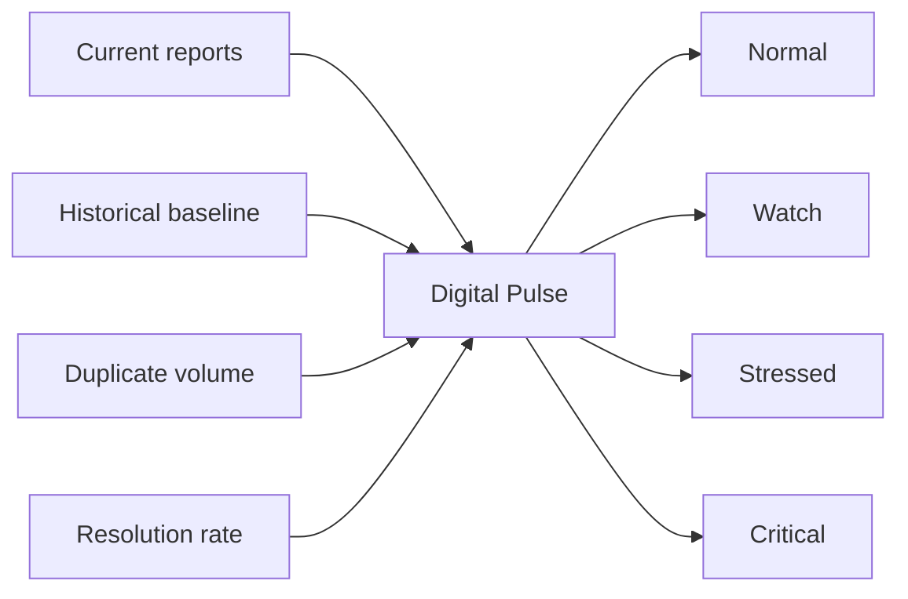
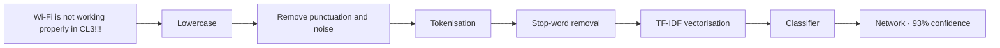
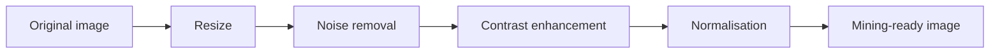
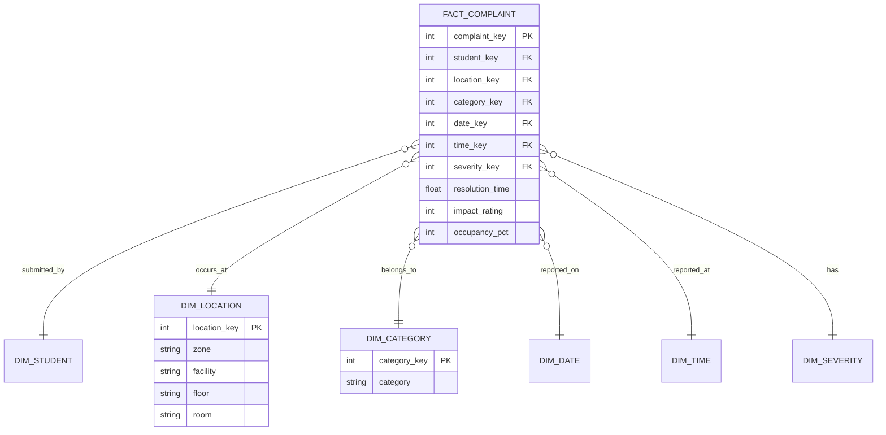

# CampusLens

### Mining the hidden problems of a college campus

CampusLens is a **Campus Friction Intelligence System** that transforms everyday student complaints into operational insight. Instead of treating each report as an isolated ticket, the platform mines complaint text, location hierarchies, timestamps, severity, images, duplicate patterns and historical trends to answer four questions:

> **What problems repeatedly affect students? Where and when do they occur? Which conditions appear together? What should the campus address first?**

The project combines a student-friendly reporting experience with an administrator-facing intelligence dashboard. It demonstrates text mining, image preprocessing, classification, clustering, association-rule mining, regression, multidimensional analysis, OLAP drill-down and data-warehouse design in one cohesive system.


---

## The problem

Students experience recurring operational friction across campus:

- unstable Wi-Fi and network outages;
- broken projectors, furniture, fans and air conditioning;
- laboratory computers and equipment failures;
- overcrowded classrooms and canteen queues;
- cleanliness and washroom issues;
- unavailable drinking water;
- parking congestion and blocked walkways.

These problems are usually reported through disconnected conversations, forms or emails. That makes it difficult to distinguish a one-off complaint from a campus-wide pattern. CampusLens creates a single analytical pipeline that consolidates reports and exposes recurring incidents, hotspots, peak periods and emerging anomalies.

## Project objectives

1. Collect structured and unstructured campus issue data.
2. Automatically classify complaint text into meaningful categories.
3. Detect similar reports and merge them into shared incidents.
4. Analyse issues across location, time, category and severity dimensions.
5. Discover hidden associations using support, confidence and lift.
6. Compare Naïve Bayes, kNN, ID3 and SVM classifiers.
7. Predict issue severity and expected resolution time.
8. Demonstrate image preprocessing using submitted evidence.
9. Present insights through a decision-support dashboard.

---

## Platform overview



CampusLens is divided into six connected modules:

| Module | Responsibility |
|---|---|
| Data Collection | Complaint form, evidence upload, location, time and identity preference |
| ETL & Preprocessing | Text normalization, tokenisation, TF-IDF and image enhancement |
| Data Warehouse | FactIssue records and analytical dimensions |
| Data Mining | Classification, duplicate detection, clustering, rule mining and prediction |
| Evaluation | Accuracy, precision, recall, F1, confusion matrix, RMSE and WEKA comparison |
| Intelligence Dashboard | Heatmaps, digital pulse, health score, trends and recommendations |

---

## Student issue reporting

The reporting flow intentionally remains simple while collecting enough metadata for mining.



Each report can contain:

- issue title and detailed description;
- automatic and user-correctable category;
- campus area, facility, floor and room;
- impact rating;
- anonymous or named submission preference;
- automatically captured timestamp;
- optional image evidence.

After submission, CampusLens returns the predicted category, confidence, risk level, estimated resolution time and any duplicate incident match.

---

## Hierarchical JIIT Sector 62 location model

A flat location dropdown cannot support room-level heatmaps or OLAP analysis. CampusLens therefore models locations as a hierarchy.



The implemented master list also includes LRC areas, administrative offices, seminar halls, sports facilities, gyms, parking, water coolers, washrooms, lifts, corridors and network-infrastructure points. Optional room codes such as `CR425`, `FF6`, `G2`, `CL22` and `TS17` can be captured without pretending that a publicly unavailable room inventory is complete.

---

## Intelligence dashboard

The dashboard is designed as a decision-support system rather than a list of complaints.


### Campus health score

The health score summarises open issue volume, severity, recurrence and resolution performance into a value from 0 to 100. It can be calculated for the whole campus, a category or an individual location.

### Campus problem heatmap

The heatmap shows issue intensity by location and time block. Administrators can move from campus-level patterns to a building, floor, room, category and specific issue.

### Emerging issue detector

Current complaint frequency is compared with historical frequency. A sudden increase—for example, projector failures rising far above their normal weekly baseline—is surfaced before it becomes a long-running problem.

### CampusLens Digital Pulse

Every location receives a continuously calculated state between **Normal** and **Critical**. The state combines repeat complaints, issue severity, duplicate volume, unresolved time and resolution rate.



---

## Text-mining pipeline

Complaint descriptions are converted from free text into features that classification algorithms can process.



The deployed form uses the exported Multinomial Naive Bayes parameters generated by `data_science/pipeline.py`. Browser inference applies the learned vocabulary, inverse-document-frequency weights, class priors and feature likelihoods rather than keyword rules. A user can accept or correct the suggested category; both the prediction and final human label are retained.

## Classification and model evaluation

The same stratified split of 2,840 labelled complaints is evaluated with six algorithms:

- Naïve Bayes;
- k-Nearest Neighbours;
- ID3 decision tree;
- Support Vector Machine;
- Random Forest;
- Multilayer Perceptron neural network.


| Model | Accuracy | Precision | Recall | F1 score |
|---|---:|---:|---:|---:|
| Naïve Bayes | 94.89% | 94.93% | 94.89% | 94.86% |
| SVM | 94.89% | 94.93% | 94.89% | 94.86% |
| Neural Network | 94.72% | 94.74% | 94.72% | 94.66% |
| kNN | 94.01% | 94.02% | 94.01% | 93.96% |
| Random Forest | 93.49% | 93.51% | 93.49% | 93.42% |
| ID3 | 92.96% | 92.92% | 92.96% | 92.83% |

These values are generated from a fixed random seed and a 568-record holdout test set. The eight-class confusion matrix contains exactly 568 evaluated predictions and its diagonal reproduces the displayed accuracy.

The platform also includes:

- confusion-matrix visualisation;
- downloadable WEKA-compatible ARFF data;
- side-by-side Python and WEKA validation support;
- best-model recommendation based on validation F1.

---

## Duplicate complaint detection

CampusLens scores duplicate candidates using token-set similarity together with normalized facility and category agreement, then consolidates matches into a shared incident.

```text
"Wi-Fi is not working in CL3"
"Internet is slow in CL3"
"CL3 network is down"
                    ↓
Incident INC-NET-74
3 related reports · HIGH priority
```

This implementation is deterministic and testable. Sentence embeddings remain a possible future experiment, but are not required to make the current duplicate score functional.

---

## Image preprocessing

Uploaded evidence is prepared for analysis using the image-processing pipeline required by the project syllabus.



The pipeline generates distinct before-and-after files using median denoising, contrast enhancement, sharpening, Lanczos resizing and pixel normalization. Uploaded evidence is independently decoded and redrawn through a canvas, which validates size and type, resizes the image and removes embedded EXIF metadata before storage.

---

## Data warehouse and OLAP

CampusLens includes a populated SQLite warehouse with 2,840 facts, surrogate keys, indexes, an SCD-ready location dimension, two data marts and documented OLAP queries. A normalized snowflake alternative is included for schema comparison.



Supported drill paths include:

```text
Campus → Zone → Facility → Floor → Room → Category → Specific issue
Year → Semester → Month → Week → Day → Hour
```

This enables questions such as:

> Show Network complaints → Labs & Research → CL3 → Floor 2 → August → 10 AM–12 PM.

---

## Association-rule mining

Apriori and FP-Growth independently mine the same one-hot transaction matrix. The pipeline verifies that both algorithms discover the same frequent-itemset set before association rules are exported.

```text
{ Facility=Annapurna / Main Mess, Time=12-2 } => { Category=Canteen }
Support, confidence, lift, leverage and conviction are exported for every rule.
```

The Pattern Rules workspace reads the generated rule artifact and provides an interactive minimum-lift filter. A companion `arules` experiment in `data_science/r/association_rules.R` reproduces the transaction design in R.

---

## Clustering and prediction

Unsupervised clustering combines reduced TF-IDF text features with standardized impact, occupancy, humidity and hour features. K-Means, hierarchical clustering and DBSCAN are compared using silhouette and Davies-Bouldin scores. Isolation Forest separately identifies anomalous complaints.

CampusLens additionally demonstrates two predictive tasks:

| Task | Type | Example output | Evaluation |
|---|---|---|---|
| Issue risk | Classification | `CRITICAL` | Accuracy, precision, recall, F1 |
| Resolution time | Regression | Expected repair hours | RMSE across Linear Regression, Random Forest and neural backpropagation |

Predicted risk considers complaint text, location, selected impact, duplicate volume and historical recurrence. Resolution time considers category, severity, location, report count and historical repair duration.

---

## Synthetic dataset

The interactive platform is seeded with synthetic complaint records so every dashboard feature can be demonstrated without exposing real student data.

Each record contains:

```text
issue_id, title, complaint, category, campus_area,
facility, floor_or_room, timestamp, impact, status,
image, predicted_category, confidence, duplicate_count,
incident_id, predicted_risk, expected_resolution_hours
```

Example record:

```json
{
  "issue_id": "CL-1048",
  "category": "Network",
  "location": "CL3 · Floor 2",
  "impact": 2,
  "status": "Recurring",
  "complaint": "Wi-Fi drops every few minutes during the morning lecture block."
}
```

Reports added through the interface are validated by a Next.js API, classified by the exported model, persisted in Neon PostgreSQL, and immediately update the live feed, report count and Issue Explorer. Search, hierarchical filters, CSV export and the complete 2,840-row WEKA ARFF operate on the shared synthetic-data layer.

---

## Functional coverage

| Capability | CampusLens implementation |
|---|---|
| Student issue reporting | Two-step anonymous/named form with hierarchical location and image upload |
| Durable operations store | Neon PostgreSQL submission table, indexes and append-only audit events |
| Automatic classification | Category and confidence returned after submission |
| Duplicate detection | Similar location/category reports merge into an incident |
| Heatmap | Location × time intensity matrix |
| Time mining | Hour and week trend visualisations |
| OLAP drill-down | Campus to room and time hierarchy |
| Data warehouse | Populated SQLite star schema, snowflake alternative, metadata catalogue and data marts |
| Association rules | Support, confidence, lift and minimum-lift filtering |
| Emerging issues | Current-versus-historical anomaly card |
| Campus health | Overall and location-oriented health indicators |
| Severity prediction | Low, medium, high or critical risk |
| Resolution prediction | Expected hours and RMSE |
| Image preprocessing | Original versus enhanced evidence pipeline |
| Clustering | K-Means, hierarchical, DBSCAN and Isolation Forest evaluation |
| Model comparison | NB, kNN, ID3, SVM, Random Forest and neural-network metrics |
| WEKA experiment | Downloadable 2,840-row, eight-class ARFF dataset |
| Digital Pulse | Normal-to-critical location state |

---

## Technology stack

- **Next.js 16** and React 19;
- TypeScript;
- Tailwind CSS processing and custom responsive CSS;
- Framer Motion for interface transitions;
- Lucide React for accessible interface icons;
- Mermaid diagrams for project documentation;
- Python, pandas, scikit-learn, mlxtend and Pillow for reproducible mining;
- SQLite star/snowflake warehouse artefacts and OLAP data marts;
- Neon PostgreSQL for durable, multi-session web submissions and audit events;
- R `arules` experiment and Power BI-ready measures;
- GitHub Actions for ETL, warehouse, metric and production-build verification;
- Vercel for the current web demonstration.

## Current scope

CampusLens is a complete, reproducible **synthetic-data academic implementation** of the mining and intelligence workflow. Raw data, clean data, model artefacts, rule outputs, clustering evaluation, processed images and the populated warehouse are versioned with the project. User-added records pass through a validated Next.js API and are stored in managed Neon PostgreSQL; a local browser copy provides resilient immediate UI feedback. Images are resized and re-encoded before upload to remove metadata. An institutional rollout would additionally require campus identity integration, role-based administration and dedicated object storage with malware scanning.

The central project idea remains the same:

> **CampusLens is not merely a complaint-management portal. It is a digital campus pulse that mines operational data to discover recurring problems, emerging anomalies and hidden relationships.**
